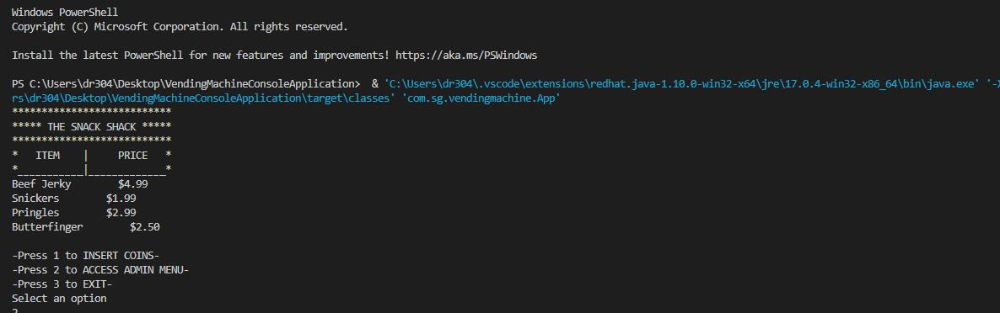
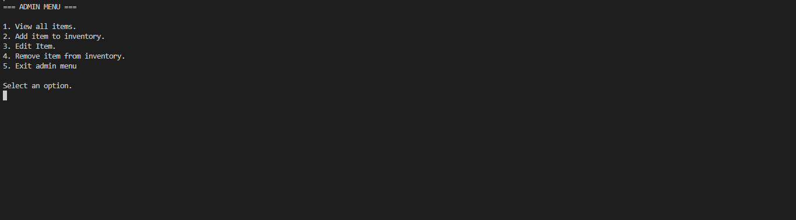

# Vending Machine Console Application

A program used to simulate the back-end process of a vending machine. 
-Built using MVC Architecture.
-Employs CRUD functionalities.
-Makes use of ENUMS for coin values.
-Data persistence to/from CSV files.
-All business logic held in a Service Layer.
-Service layer and DAOs tested thoroughly with JUnit.

Technologies used:

(https://skills.thijs.gg/icons?i=java,spring,git,maven)

